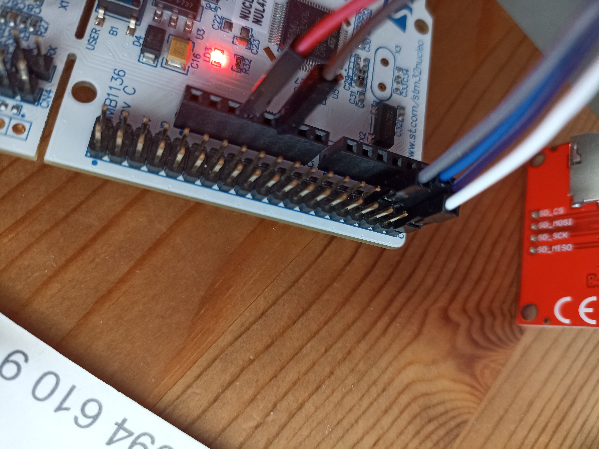
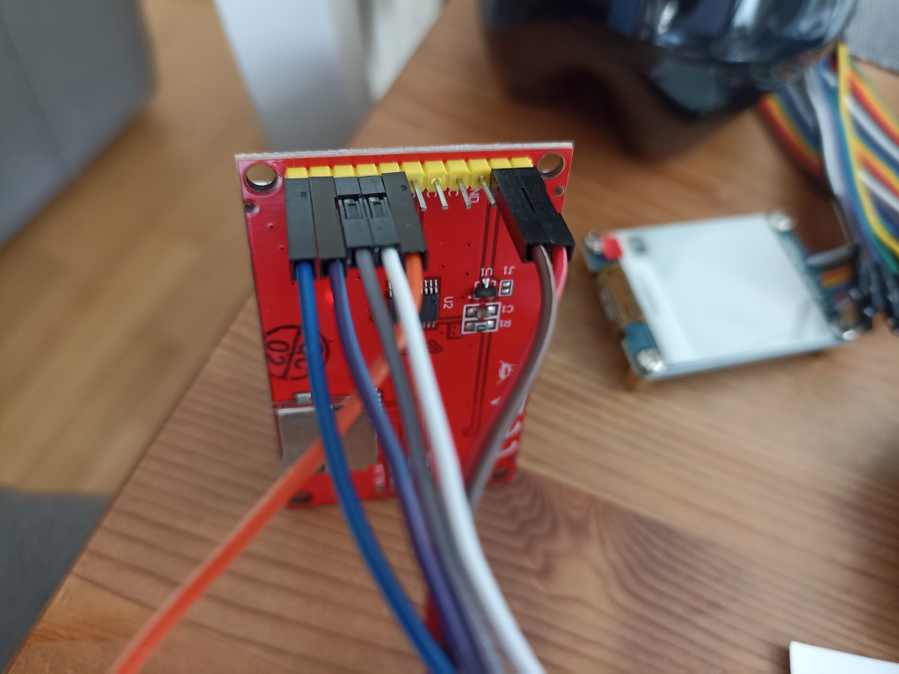

# Credits

ILI9225 SPI library from: https://github.com/BasicCode/ILI9225


# Links

https://github.com/BasicCode/ILI9225/blob/master/STM32/main.c
https://github.com/BasicCode/ILI9225/tree/master/STM32


# STMCube IDE Cube MX Configuration

Open the .ioc file and activate the SPI2 interface under the "Connectivity" section.

SPI 2 
Mode: Half Duplex Master
Prescaler for baudrate: 64
Data Size: 8 bit
Clock Polarity CPOL: High
Clock Phase CPHA: 1 Phase
CRC Calculation: Disable
NSSP Mode: Enabled
First Bit: MSB First


pinout of the SPI hardware is:
PB10 is SPI2_SCK (clock) ------ Nucleo Pinout: PWM/D6                    -------- LCD: CLK
PC3 is SPI2_MOSI -------------- Nucleo Pinout: CN7 header (links unten)  -------- LCD: SDA
PB0 Cmd ----------------------- Nucleo Pinout: CN7 header                -------- LCD: RS (Command or Data)
PC0 RST ----------------------- Nucleo Pinout: CN7 header (rechts unten) -------- LCD: RST
PC1 CS ------------------------ Nucleo Pinout: CN7 header                -------- LCD: CS


# Pins

Open the .ioc file > System Core > GPIO

```
#define RST_Pin GPIO_PIN_0
#define RST_GPIO_Port GPIOC
#define CS_Pin GPIO_PIN_1
#define CS_GPIO_Port GPIOC
#define LED_Pin GPIO_PIN_5
#define LED_GPIO_Port GPIOA
#define CMD_Pin GPIO_PIN_0
#define CMD_GPIO_Port GPIOB
```

PIN_0 -- GPIOC == RESET pin (reset)
In the .ioc file, set the pin PC0 to type GPIO_output.
Mode: Output Push Pull
Maxium Output Speed: Low
Optionally under the "User Label" field, you can enter RST. This causes the source code to contain your user label as pin name instead of the generic pin name

PIN_1 -- GPIOC == CS pin (chip select)
In the .ioc file, set the pin PC1 to type GPIO_output.
Optionally under the "User Label" field, you can enter CS.

PIN_0 -- GPIOB == CMD pin (Command/Data pin)
In the .ioc file, set the pin PB0 to type GPIO_output.
Optionally under the "User Label" field, you can enter CMD.


# Wiring





